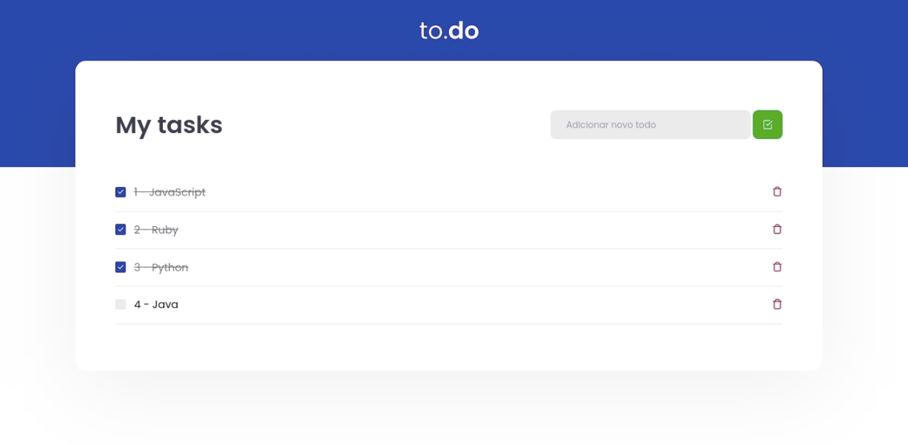

<h1 align="center">   </h1> 


<h1 align="center">
     ✔️ ToDo List
</h1> 


# :books: About

<p> This project's main objective is to build a small application of a to-do list and training a little more about state manipulation in React. </p>


# :wrench: Application features

* Add a new task: It must be possible to add a new task in the task state with the fields id which must be generated randomly, a title which must be text and isComplete which must start as false.
* Remove a task: You must receive an ID by parameter and remove the task that contains that ID from the state.
* Mark and unmark a task as completed: You must change the status of isComplete for a task with a specific ID that is received by parameter.

# :art: Layout

<div align="center">
  <p align="center">
    
  </p>
</div>

# :hammer: Tecnologies

- React.js
- Typescript
- Yarn
- SCSS
- Webpack

# 🔧 Run Locally

Clone the project

```bash
  git clone git@github.com:Joseane-Guedes/ignite-reactjs-challenge01.git
```

Go to the project directory

```bash
  cd ignite-reactjs-challenge01
```

Install dependencies

```bash
  yarn install
```

Start the server

```bash
  yarn dev 
```


# :closed_book: License

Released in 2021 :closed_book: License

This project is under the [MIT license](./LICENSE).


#

<!-- <p align="center">
   <b> &#60;/&#62; by <a href="https://www.linkedin.com/in/joseane-guedes/">Joseane Guedes</a></b>
</p> -->

Made with :purple_heart: by [Rocketseat](https://rocketseat.com.br/ignite) :rocket: and [Joseane Guedes ](https://github.com/Joseane-Guedes) :woman_technologist: 
