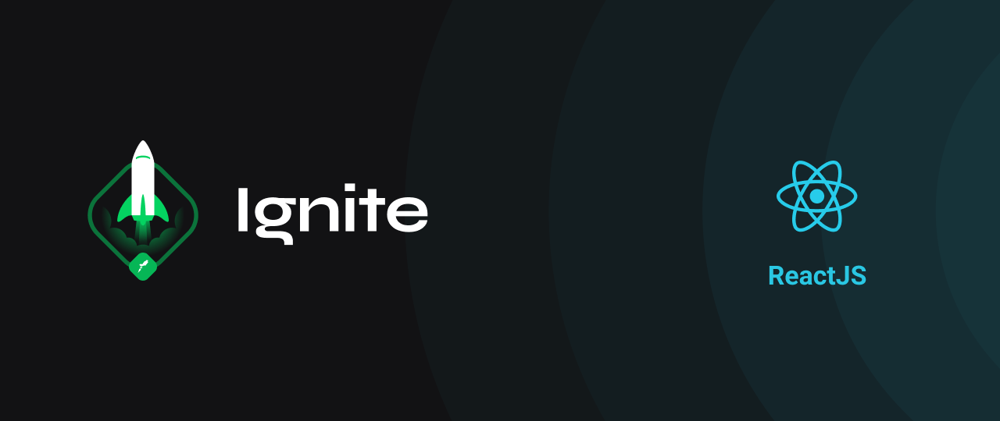

<h1 align="center">   </h1> 

<h1 align="center">
    <a href="https://pt-br.reactjs.org/">  ⚛️  ReactJS   </a>
</h1> 

<h2 align="center">🚀 Challenge 01: ReactJS Concepts </h2>

# :books: About

 This project's main objective is to build a small application of a to-do list and training a little more about state manipulation in React. 

# :wrench: Application features

* Add a new task: It must be possible to add a new task in the task state with the fields id which must be generated randomly, a title which must be text and isComplete which must start as false.
* Remove a task: You must receive an ID by parameter and remove the task that contains that ID from the state.
* Mark and unmark a task as completed: You must change the status of isComplete for a task with a specific ID that is received by parameter.

# :art: Layout

  

    
  

# :hammer: Tecnologies

- React.js
- Typescript
- SCSS
- HTML

# 🔧 How to run

- Download this project to your computer or use the git command `git clone git@github.com:Joseane-Guedes/ignite-reactjs-challenge01.git`

- Run `$ yarn install` to install the project's modules

### Webpage

- Open the folder ignite-reactjs-challenge01 in your system's shell
- Run `$ yarn dev`

# :closed_book: License

Released in 2021 :closed_book: License

This project is under the [MIT license](./LICENSE).

#

<!-- 

   <b> &#60;/&#62; by <a href="https://www.linkedin.com/in/joseane-guedes/">Joseane Guedes</a></b>

 -->

Made with :purple_heart: by Joseane Guedes 
